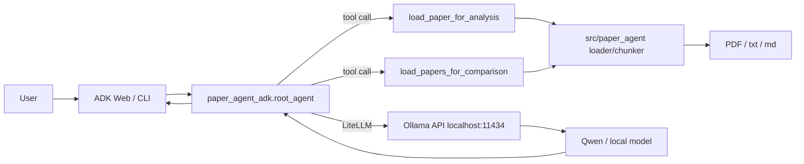

# Paper Agent

ローカルLLMで論文を読み取り、要点整理・比較・質問応答を行うための ADK agent です。

Google Agent Development Kit (ADK) の Web UI または CLI から起動し、Ollama 上のモデルに問い合わせます。現在のデフォルトモデルは `qwen3.5:9b-q8_0` です。

## 構成



agent 本体は [paper_agent_adk/agent.py](paper_agent_adk/agent.py) の `root_agent` です。

ADK に公開している tool は次の2つです。

- `load_paper_for_analysis`: 1本の論文を読む
- `load_papers_for_comparison`: 複数論文を同じ観点で比較する

## Setup

Python 環境を作成します。

```bash
cd /Users/ikedadaito/Desktop/自習/NLP/PaperAgent

python3 -m venv .venv
source .venv/bin/activate
python -m pip install -e ".[dev]"
```

Ollama をインストールして起動します。

- macOS: https://ollama.com/download/mac
- `ollama --version` が通ることを確認してください。

モデルを取得します。

```bash
ollama pull qwen3.5:9b-q8_0
ollama list
```

Ollama サーバーが動いているか確認します。

```bash
curl http://localhost:11434/api/tags
```

JSON が返れば接続できます。返らない場合は、Ollama アプリを起動するか、CLI が使える環境で次を実行してください。

```bash
ollama serve
```

## 起動

Web UI で使う場合:

```bash
cd /Users/ikedadaito/Desktop/自習/NLP/PaperAgent
source .venv/bin/activate

export ADK_OLLAMA_MODEL=qwen3.5:9b-q8_0
export OLLAMA_API_BASE=http://localhost:11434

adk web .
```

ブラウザで開きます。

```text
http://127.0.0.1:8000
```

agent 一覧から `paper_agent_adk` を選択してください。

CLI で対話する場合:

```bash
adk run paper_agent_adk
```

1回だけ問い合わせる場合:

```bash
adk run paper_agent_adk "papers/2512.20687v2.pdf を読んで、研究目的と提案手法を整理してください"
```

## 使い方

PaperAgent はファイルアップロードではなく、基本的に **ローカルファイルパスを指定して読む** 使い方です。

プロジェクト配下のPDFを読む例:

```text
papers/2512.20687v2.pdf を読んで、研究背景、研究目的、提案手法、実験設定、主な結果を整理してください。
```

絶対パスで指定する例:

```text
/Users/ikedadaito/Desktop/自習/NLP/PaperAgent/papers/2512.20687v2.pdf を読んで、研究背景、研究目的、提案手法、実験設定、主な結果を整理してください。
```

複数論文を比較する例:

```text
papers/paper1.pdf と papers/paper2.pdf を比較して、研究背景、研究目的、提案手法、実験設定、主な結果、限界を同じ観点で整理してください。
```

論文中の特定事項について質問する例:

```text
papers/2512.20687v2.pdf について、提案手法が既存TransformerのKV cache問題をどう扱っているか説明してください。根拠となるchunk_indexも示してください。
```

## ファイルアクセス範囲

デフォルトでは、`adk web .` を起動した作業ディレクトリ配下のファイルだけを読みます。

別ディレクトリの論文を扱う場合は、起動前に許可ディレクトリを指定してください。

```bash
export PAPER_AGENT_ALLOWED_DIR=/path/to/papers
adk web .
```

注意: 先頭に `/` を付けたパスは絶対パスです。

```text
/papers/sample.pdf
```

はプロジェクト内の `papers/sample.pdf` ではなく、Mac のルート直下 `/papers/sample.pdf` を意味します。

## モデル設定

デフォルトでは `qwen3.5:9b-q8_0` を使います。

別モデルを使う場合は `ADK_OLLAMA_MODEL` を変更してください。`ollama list` の `NAME` と完全一致させます。

```bash
ollama list

export ADK_OLLAMA_MODEL=<ollama-listに出ているモデル名>
adk web .
```

Ollama / Qwen 向けに、agent では次の設定を LiteLLM に渡しています。

- `think=False`: thinking だけ出て本文が空になる問題を避ける
- `temperature=0.2`: 要約の揺れを抑える
- `num_ctx=8192`: 入力コンテキスト長
- `num_predict=2048`: 最大出力トークン数

環境変数で一部変更できます。

```bash
export ADK_OLLAMA_NUM_CTX=16384
export ADK_OLLAMA_NUM_PREDICT=4096
```

大きくすると長い論文を扱いやすくなる場合がありますが、メモリ使用量と実行時間も増えます。

## 全文読み込みについて

現在の実装では、PDFから抽出された全chunkを tool 結果として返します。

例:

```text
chunk_count == returned_chunk_count
truncated == False
```

ただし、全文を一度にローカルLLMへ渡すため、論文が長い場合は次の問題が起きる可能性があります。

- 応答が遅い
- PCが重くなる
- `MODEL_RETURNED_NO_CONTENT` が出る
- Ollama 側でメモリ不足に近い挙動になる

安定性を重視する場合は、将来的には「chunkごとに要約し、最後に統合する」段階的な処理にするのが望ましいです。

## 出力方針

agent は次の観点で整理するよう指示されています。

- 研究背景
- 研究目的
- 提案手法
- 実験設定
- 主な結果
- 既存手法との違い
- 研究の限界
- 今後の発展可能性
- 根拠
- 不明点

回答では次を重視します。

- 論文に書かれている内容と解釈を区別する
- 根拠となる `page` / `chunk_index` を可能な限り示す
- 論文に記載されていない内容は断定しない
- 複数論文では比較基準を統一する

## Troubleshooting

### `adk: command not found`

仮想環境が有効になっていない可能性があります。

```bash
cd /Users/ikedadaito/Desktop/自習/NLP/PaperAgent
source .venv/bin/activate
which adk
```

直接実行することもできます。

```bash
./.venv/bin/adk web .
```

### `Cannot connect to host localhost:11434`

Ollama が起動していません。

```bash
curl http://localhost:11434/api/tags
```

失敗する場合は Ollama アプリを起動するか、次を実行してください。

```bash
ollama serve
```

### `model '<name>' not found`

指定したモデルが Ollama にありません。

```bash
ollama list
ollama pull qwen3.5:9b-q8_0
```

`ADK_OLLAMA_MODEL` は `ollama list` に出る名前と一致させてください。

### `MODEL_RETURNED_NO_CONTENT`

モデルが本文なしで終了した状態です。

主な原因:

- 入力が長すぎる
- モデルが重すぎる
- thinking 対応モデルが本文ではなく reasoning 側だけ返している

この agent では `think=False` を設定していますが、まだ出る場合は次を試してください。

```bash
export ADK_OLLAMA_NUM_CTX=16384
export ADK_OLLAMA_NUM_PREDICT=4096
```

または、より軽いモデルを使ってください。

## Tests

```bash
source .venv/bin/activate
python -m pytest
```
